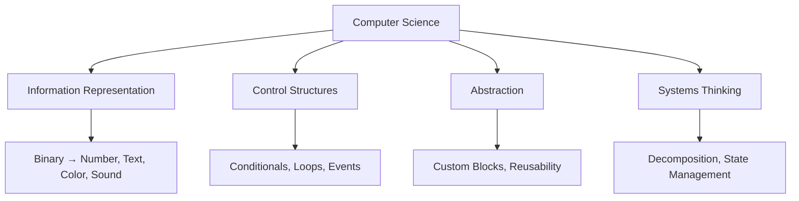

# Week 00 — Scratch, Logic, Abstraction

> Track: cs50x  
> Week: 00  
> Protocol: Second Mind OS  
> Format: Verified Thinking Notes + Schema-Driven Capture

## Objective

- **Core Concept(s)**:

  - Programming is not code — it is structured problem solving.
  - Scratch is a cognitive scaffold to visualize event-driven logic, control flow, state, and modularity.

- **Outcome**:

  - Build a system using Scratch that reacts to input, tracks state, branches conditionally, and abstracts actions into reusable logic blocks.

- **Protocol Scope**:
  - This note is a `Check + Reflect` artifact in the P.A.C.E.R. loop
  - It documents the structure, insight, and delta extracted from Week 0 + Problem Set 0.

---

## Concept Map

## Mental Models

| Concept          | Model / Metaphor       | First-principle Breakdown                           |
| ---------------- | ---------------------- | --------------------------------------------------- |
| Binary           | On/Off Switch Grid     | Every digital signal resolves to base-2             |
| Conditionals     | Fork in logic pathway  | Logic chain branches based on boolean evaluation    |
| Loops            | Conveyor belt of logic | Repeat operations over iteration count or state     |
| Variable (State) | Named box with memory  | Tracks evolving data across logic flow              |
| Abstraction      | Black-box toolkit      | Encapsulation of intent → simplifies complexity     |
| Sprite/Script    | Event-triggered agents | Decentralized logic containers (like microservices) |

## 📣 ⌬ Insight Claims

| ⌬ ID | Claim Statement                                             | Trigger Point      | Verified In                          |
| ---- | ----------------------------------------------------------- | ------------------ | ------------------------------------ |
| 0001 | “Programming is structured control over state + flow.”      | Lecture + PSet 0   | `logs/2025-05-19-week-00-scratch.md` |
| 0002 | “Loops ≠ repetition — they compress predictable structure.” | Script refactor    | `loop/week-00-scratch/pacer.yaml`    |
| 0003 | “Abstraction = compress intent into callable logic.”        | Custom Block usage | `loop/week-00-scratch/claim.md`      |

---

## 🚧 Blockers / Ambiguities

- When does abstraction in Scratch actually increase clarity vs add indirection?
- How to measure “complex enough” for Scratch projects in problem set grading logic?
- Difference between control via loop vs event-chaining in Scratch?

---

## 🧪 Tests / Self-Checks

1. What are the 6 required elements of Problem Set 0, and what concept does each represent?
2. How would you represent a state machine using only Scratch primitives?
3. Can you refactor 3 scripts into 1 custom block + loop and preserve behavior?

---

## 📃 Trace Log / Learning Path

- [x] Watched Lecture 0 (CS50x)
- [x] Studied Problem Set 0 requirements
- [x] Built Scratch project with full constraint coverage
- [x] Verified logic flow (loop, if, variable, custom block)
- [x] Exported `.sb3` and validated structure
- [x] Finalized ⌬ claim map
- [x] Published `outputs/week-00-scratch/output.md`

---

## 🔁 Linked Protocol Loops

| Loop Phase | Linked File                       |
| ---------- | --------------------------------- |
| Plan       | `loop/week-00-scratch/pacer.yaml` |
| Reflect    | `loop/week-00-scratch/reflect.md` |

---

> _Powered by [Second Mind OS Lab](https://github.com/secondmindlab) — Protocol-first learning system for cognitive leverage._
