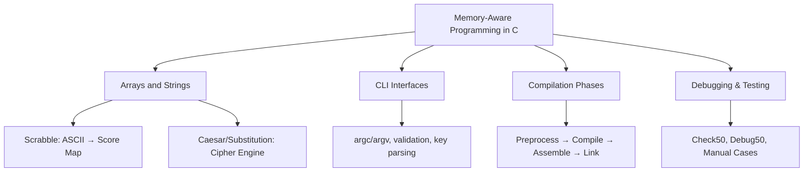

# Week 02 — Arrays, Strings, CLI

> Track: cs50x
> Week: 02
> Protocol: Second Mind OS
> Format: Verified Thinking Notes + Schema-Driven Capture

## Objective

- **Core Concepts**:

  - C memory model: array, string, ASCII
  - Compilation pipeline: preprocessing → compile → assemble → link
  - Debug stack: `printf`, `debug50`, `valgrind`
  - CLI interfaces: `argv`, `argc`, validation logic
  - Text processing: cipher mapping, readability indices

- **Outcome**:

  - Build 3 cryptographic + scoring engines
  - Understand text → logic → encoding transformation
  - Write memory-safe, modular, readable C

- **Protocol Scope**:

  - This note anchors Check + Reflect phase of `week-02-arrays` loop
  - Integrates claims and looped decisions from PSet2 executions

## Concept Map / Schema

## Mental Models

| Concept       | Model / Metaphor                      | First-principle Breakdown                         |
| ------------- | ------------------------------------- | ------------------------------------------------- |
| Array as Map  | “Box of fixed slots”                  | Continuous memory; index = offset from base       |
| ASCII Shift   | “Alphabet ring”                       | Modulo math around 26 letters                     |
| Cipher Logic  | “Rule engine → transforms characters” | Char → normal form → key map → transformed output |
| Compile Stack | “Translation assembly line”           | Preprocessing → compiler → assembler → linker     |
| CLI Args      | “Dynamic params from shell”           | argc = count, argv = input set                    |

## 📣 ⌬ Insight Claims

| ⌬ ID | Claim Statement                                            | Trigger Point      | Verified In                         |
| ---- | ---------------------------------------------------------- | ------------------ | ----------------------------------- |
| 021  | "Modulo logic creates cyclic transformations in alphabets" | Substitution.c     | `loop/week-02-arrays/claim.md`      |
| 022  | "Command-line args are the native interface of automation" | Caesar key input   | `loop/week-02-arrays/pacer.yaml`    |
| 023  | "Encryption is a function: char → normalized → mapped"     | During pset        | `logs/2025-05-25-week-02-arrays.md` |
| 024  | "Output structure is a mirror of input logic clarity"      | Caesar/Readability | `reflect.md`                        |

## 🚧 Blockers / Ambiguities

- Is it acceptable to reuse real-world crypto patterns in simplified Caesar?
- When does `argv[1]` not exist even if typed in terminal?
- Limits of `strlen()` with malformed or NULL strings?

These were explored or partially addressed during debugging, but not yet escalated.

## 🧪 Tests / Self-Checks

1. Explain why `POINTS[c - 'A']` is valid for uppercase only.
2. Write a `rotate()` function that preserves case and skips non-alpha characters.
3. Design test cases for a substitution cipher that would trigger duplicate key errors.

## 📃 Trace Log / Learning Path

- [x] Analyzed lecture (compiling, memory, strings)
- [x] Completed Scrabble.c → array + ASCII practice
- [x] Completed Readability.c → text parsing, index calculation
- [x] Completed Caesar.c → CLI + modulo shift
- [x] Completed Substitution.c → key validation + mapping logic
- [x] Used check50, style50 for all
- [x] Maintained \~2–4h buffer between submit50 cycles
- [ ] Pushed `reflect.md`, `claim.md` to output

## 🔁 Linked Protocol Loops

| Loop Phase | Linked File                                       |
| ---------- | ------------------------------------------------- |
| Plan       | `loop/week-02-arrays/pacer.yaml`                  |
| Reflect    | `logs/2025-05-25-week-02-arrays.md`               |
| Claim      | `loop/week-02-arrays/claim.md`                    |
| Output     | `outputs/week-02-arrays/week-02-arrays-output.md` |

---

> _Powered by **Second Mind OS Lab** — recursive protocol lab for sovereign cognitive architecture._
